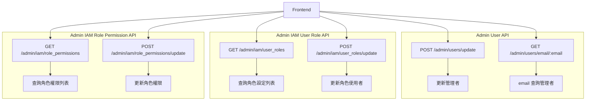
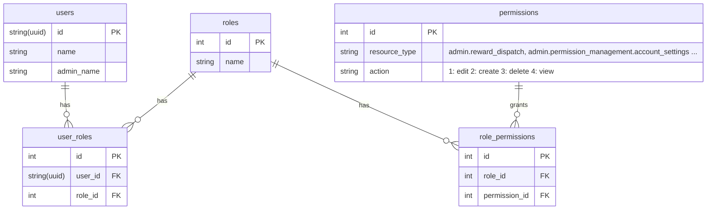

# Wireframe

https://www.figma.com/board/WVmwn7pETlWmB8cHrEJcUi/Product-Team_Festure?node-id=547-15384&t=UEVYzcwFkvGzVm6s-0

# API Design

## Flow



## Endpoints

### Admin User API

#### POST /admin/users/update

- **Description**: 更新管理者
- **Request Body**:

```json
{
  "added_users": [
    {
      "user_id": "string",
      "admin_name": "string"
    }
  ],
  "removed_users": ["string(user_id)"]
}
```

- **HTTP Status Codes**:
  - `204 No Content`
  - `404 Not Found`: User not found

#### GET /admin/users/email/:email

- **Description**: email 查詢管理者 (User Object)
- **Response**:

```json
{
  "id": "string(uuid)",
  "email": "string",
  "name": "string",
  "admin_name": "string",
  "permissions": [
    {
      "resource_type": "string (e.g. admin.reward_dispatch, admin.permission_management.account_settings ...)",
      "actions": ["string (e.g. edit, create, delete, view)"]
    }
  ]
}
```

- **HTTP Status Codes**:
  - `200 OK`
  - `404 Not Found`

### IAM User Role API

#### GET /admin/iam/user_roles

- **Description**: 查詢角色設定列表
- **Response**:

```json
{
  "roles": [
    {
      "id": "int",
      "name": "string (e.g. Admin, Team Lead)",
      "users": [
        {
          "id": "string(uuid)",
          "email": "string",
          "admin_name": "string"
        }
      ]
    }
  ]
}
```

- **HTTP Status Codes**:
  - `200 OK`

#### POST /admin/iam/user_roles/update

- **Description**: 更新角色使用者
- **Request Body**:

```json
{
  "added": [
    {
      "role_id": "int",
      "user_id": "string(uuid)"
    }
  ],
  "removed": [
    {
      "role_id": "int",
      "user_id": "string(uuid)"
    }
  ]
}
```

- **HTTP Status Codes**:
  - `204 No Content`
  - `404 Not Found`: Role not found / User not found

### IAM Role Permission API

#### GET /admin/iam/role_permissions

- **Description**: 查詢角色權限列表
- **Response**:

```json
{
  "roles": [
    {
      "id": "int",
      "name": "string (e.g. Admin, Team Lead)",
      "permissions": [
        {
          "id": "int",
          "resource_type": "string (e.g. admin.reward_dispatch, admin.permission_management.account_settings ...)",
          "actions": ["string (e.g. edit, create, delete, view)"]
        }
      ]
    }
  ]
}
```

- **HTTP Status Codes**:
  - `200 OK`

#### POST /admin/iam/role_permissions/update

- **Description**: 更新角色權限
- **Request Body**:

```json
{
  "added": [
    {
      "role_id": "int",
      "permission_id": "int"
    }
  ],
  "removed": [
    {
      "role_id": "int",
      "permission_id": "int"
    }
  ]
}
```

- **HTTP Status Codes**:
  - `204 No Content`
  - `404 Not Found`: Role not found / Permission not found

## Note

- Return 403 Forbidden if the user does not have permission to access the admin endpoint.
- `resource_type` is a string enum
  - `admin.reward_dispatch`: 派獎系統
  - `admin.permission_management.account_settings`: 帳號設定
  - `admin.permission_management.user_roles`: 角色設定
  - `admin.permission_management.role_permissions`: 角色權限

# Backend Design

## Database Schema



### user_roles

- Unique key: (user_id, role_id)

### role_permissions

- Unique key: (role_id, permission_id)
