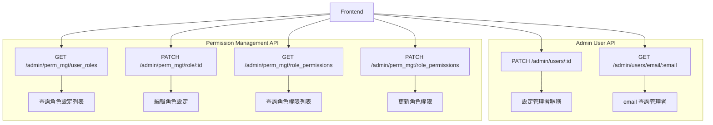
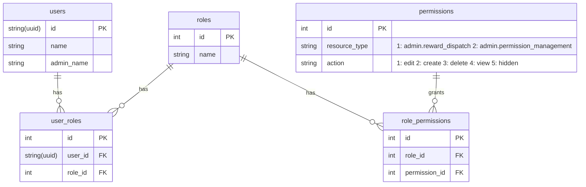

# API Design

## Flow



## Endpoints

### Admin User API

#### PATCH /admin/users/:id

- **Description**: 設定使用者資料 (管理者暱稱)
- **Request Body**:

```json
{
  "admin_name": "string"
}
```

- **HTTP Status Codes**:
  - `204 No Content`

#### GET /admin/users/email/:email

- **Description**: 根據 email 查詢使用者資料
- **Response**:

```json
{
  "id": "string(uuid)",
  "email": "string",
  "name": "string",
  "admin_name": "string"
}
```

- **HTTP Status Codes**:
  - `200 OK`
  - `404 Not Found`

### Permission Management API

#### GET /admin/perm_mgt/user_roles

- **Description**: 查詢角色設定列表
- **Response**:

```json
{
  "roles": [
    {
      "id": "int",
      "name": "string (e.g. Admin, Team Lead)",
      "users": [
        {
          "id": "string(uuid)",
          "email": "string",
          "admin_name": "string"
        }
      ]
    }
  ]
}
```

- **HTTP Status Codes**:
  - `200 OK`

#### PATCH /admin/perm_mgt/role/:id

- **Description**: 編輯角色設定
- **Request Body**:

```json
{
  "added_user_ids": ["string(user_id, 新增管理者)"],
  "removed_user_ids": ["string(user_id, 刪除管理者)"]
}
```

- **HTTP Status Codes**:
  - `204 No Content`
  - `404 Not Found`: Role not found / User not found

#### GET /admin/perm_mgt/role_permissions

- **Description**: 查詢角色權限列表
- **Response**:

```json
{
  "roles": [
    {
      "id": "int",
      "name": "string (e.g. Admin, Team Lead)",
      "permissions": [
        {
          "resource_type": "string (e.g. admin.reward_dispatch, admin.permission_management)",
          "action": "string (e.g. edit, create, delete, view, hidden)"
        }
      ]
    }
  ]
}
```

- **HTTP Status Codes**:
  - `200 OK`

#### PATCH /admin/perm_mgt/role_permissions

- **Description**: 更新角色權限
- **Request Body**:

```json
{
  "added": [
    {
      "role_id": "int",
      "resource_type": "string (e.g. admin.reward_dispatch, admin.permission_management)",
      "action": "string (e.g. edit, create, delete, view, hidden)"
    }
  ],
  "removed": [
    {
      "role_id": "int",
      "resource_type": "string (e.g. admin.reward_dispatch, admin.permission_management)",
      "action": "string (e.g. edit, create, delete, view, hidden)"
    }
  ]
}
```

- **HTTP Status Codes**:
  - `204 No Content`
  - `404 Not Found`: Role not found / Permission not found

# Backend Design

## Database Schema


