# Wireframe

https://www.figma.com/board/WVmwn7pETlWmB8cHrEJcUi/Product-Team_Festure?node-id=547-15384&t=UEVYzcwFkvGzVm6s-0

# API Design

## Sequence Diagram

```mermaid
sequenceDiagram
  Frontend ->>+ Backend: GET /me
  Backend -->>- Frontend: 回傳 🆕 帶有權限的使用者資訊
  Frontend ->> Frontend: 檢查權限以顯示功能分頁

  alt 進入 Account Settings 帳號設定頁面
    alt 列出所有管理者
      Frontend ->>+ Backend: 🆕 GET /admin/admins
      Backend -->>- Frontend: 回傳管理者列表
    else 以 email 搜尋管理者
      Frontend ->>+ Backend: 🆕 GET /admin/admins/email?email=
      Backend -->>- Frontend: 回傳符合 email 的管理者資訊
    else 儲存管理者 (新增/編輯/刪除)
      Frontend ->>+ Backend: 🆕 POST /admin/admins/save
      Backend -->>- Frontend: 回傳成功
    end
  else 進入 Role Settings 角色設定頁面
    alt 列出所有角色管理者
      Frontend ->>+ Backend: 🆕 GET /admin/iam/role_users
      Backend -->>- Frontend: 回傳角色管理者列表
    else 儲存角色管理者 (新增/刪除)
      Frontend ->>+ Backend: 🆕 POST /admin/iam/role_users/save
      Backend -->>- Frontend: 回傳成功
    end
  else 進入 Role Permissions 角色權限設定頁面
    alt 列出所有角色權限
      Frontend ->>+ Backend: 🆕 GET /admin/iam/role_permissions
      Backend -->>- Frontend: 回傳角色權限列表
    else save
      Frontend ->>+ Backend: 🆕 POST /admin/iam/role_permissions/save
      Backend -->>- Frontend: 回傳成功
    end
  end
```



## API Specification

PR: https://github.com/17media/wave-openapi/pull/6

### Note

- Return 403 Forbidden if the user does not have permission to access the admin endpoint.
- We don't use `/admin/users` to get admin users because it's been used to retrieve elaborate user information by admin currently. Instead, we use `/admin/admins` to retrieve admin users only.

# Backend Design

## Database Schema


### Tables

#### RoleUsers

- Unique key: (userID, roleID)

#### RolePermissions

- Unique key: (roleID, permissionID)

## High-Level Design

### 🆕 **[API] Admins**

#### list(c \*gin.Context)

##### GET /admin/admins

- Calls User store `ListAdmins`

#### getByEmail(c \*gin.Context)

##### GET /admin/admins/email?email=

- Calls User store `GetAdminByEmail`

#### save(c \*gin.Context)

##### POST /admin/admins/save

- Calls User store `SaveAdmin`

### 🆕 **[API] IAM**

#### listRoleUsers(c \*gin.Context)

##### GET /admin/iam/role_users

- Calls IAM store `ListUserRole`

#### saveRoleUsers(c \*gin.Context)

##### POST /admin/iam/role_users/save

- Calls IAM store `SaveUserRole`

#### listRolePermissions(c \*gin.Context)

##### GET /admin/iam/role_permissions

- Calls IAM store `ListRolePermission`

#### saveRolePermissions(c \*gin.Context)

##### POST /admin/iam/role_permissions/save

- Calls IAM store `SaveRolePermission`

### Middleware

Middleware to check if the user has permission to access the admin endpoint.

- `authenticated(us user.Store, options ...func(*authOption))`
  - `authOption`
    - 🆕 option func: `WithPermission(permission)`
      - support single permission check is enough for current use cases.
  - logic
    - check if permissions are provided
    - if yes, call `us.Get` with options that will pass to `us.decorate` function to verify user permissions
  - usage
    ```go
    apis.Handle(arg, "GET", "/reward_dispatch",
      authenticated(us,
        WithPermission(models.Permission{
          {ResourceType: models.PermAdminRewardDispatch, Action: models.PermActionView},
        }),
      ),
    )
    apis.Handle(arg, "POST", "/reward_dispatch/import",
      authenticated(us,
        WithPermission(models.Permission{
          {ResourceType: models.PermAdminRewardDispatch, Action: models.PermActionCreate},
        }),
      ),
    )
    apis.Handle(arg, "DELETE", "/reward_dispatch/delete/:rewardScheduleID",
      authenticated(us,
        WithPermission(models.Permission{
          {ResourceType: models.PermAdminRewardDispatch, Action: models.PermActionDelete},
        }),
      ),
    )
    ```

### **[Store] User**

#### 🔄 decorate(context ctx.CTX, user \*models.User, required \*models.Permission) error

- If `required` permission is not null:
  - Calls `GetUserPermissions` from IAM store to get user permissions.
  - If user does not have required permission, return `INSUFFICIENT_PERMISSION` error with 403 Forbidden.
  - Decorate permissions to the user object.
- `required` permission is optional for admin API, which is not required for normal user operations.

#### 🆕 GetAdminByEmail(context ctx.CTX, email string) (\*models.User, error)

- Calls `im.GetByEmail`
- Return USER_NOT_ADMIN if `Admin = 0` in user object.

#### 🆕 ListAdmins(context ctx.CTX) ([]\*models.User, error)

- Fetch all users with `Admin = 1` from the MongoDB.

#### 🆕 SaveAdmin(context ctx.CTX, inputs SaveAdminInputs) error

- Save admin users, including adding, updating, and removing admin users.
  - Set `Admin = 1` for new admin users.
  - Set `Admin = 0` for removed admin users.
  - Update `AdminName` for updated admin users.

### **🆕 [Store] IAM**

#### CreatePermission(context ctx.CTX, permission \*models.Permission) error

- Insert into table: `Permissions`.
- Called by script (not exposed to API/Dashboard yet)

#### GetPermission(context ctx.CTX, permissionID int) (\*models.Permission, error)

- Get from table: `Permissions`

#### CreateRole(context ctx.CTX, role \*models.Role) error

- Insert into table: `Roles`.
- Called by script (not exposed to API/Dashboard yet)

#### GetRole(context ctx.CTX, roleID int) (\*models.Role, error)

- Get from table: `Roles`

#### ListUserRole(context ctx.CTX) (\*models.RolesUsers, error)

- Get from table: `RoleUsers`.

#### GetUserRoleByUser(context ctx.CTX, userID string) (\*models.RolesUsers, error)

- Get from table: `RoleUsers` filtered by userID.

#### SaveUserRole(context ctx.CTX, inputs \*SaveUserRoleInputs) error

- Call `im.grantUserRole()` with `inputs.Add` and `im.revokeUserRole()` with `inputs.Remove` to save user roles.

#### grantUserRole(context ctx.CTX, inputs \*UserRoleInputs) error

- Upsert user roles into table: `RoleUsers`.
  - status = 1 (granted)
  - createdAt = current timestamp if not exists
  - updatedAt = current timestamp
- Evict cache
  - key: `iam:user_permissions:{userID}` cached by `GetUserPermissions()`

#### revokeUserRole(context ctx.CTX, inputs \*UserRoleInputs) error

- Update user roles into table: `RoleUsers`.
  - status = 0 (revoked)
  - updatedAt = current timestamp
  - return error if user role relation is not found
- Evict cache
  - key: `iam:user_permissions:{userID}` cached by `GetUserPermissions()`

#### ListRolePermission(context ctx.CTX) (\*models.RolesPermissions, error)

- Get from table: `RolePermissions`.

#### GetRolePermissionByRole(context ctx.CTX, roleID string) (\*models.RolesPermissions, error)

- Get from table: `RolePermissions` filtered by roleID.

#### SaveRolePermission(context ctx.CTX, inputs \*SavePermissionInputs) error

- Call `im.grantRolePermission()` with `inputs.Add` and `im.revokeRolePermission()` with `inputs.Remove` to save role permissions.

#### grantRolePermission(context ctx.CTX, inputs \*RolePermissionInputs) error

- Upsert role permissions into table: `RolePermissions`.
  - status = 1 (granted)
  - createdAt = current timestamp if not exists
  - updatedAt = current timestamp
- Evict cache
  - key: `iam:user_permissions:{userID}` cached by `GetUserPermissions()`

#### revokeRolePermission(context ctx.CTX, inputs \*RolePermissionInputs) error

- Update role permissions into table: `RolePermissions`.
  - status = 0 (revoked)
  - updatedAt = current timestamp
  - return error if role permission relation is not found
- Evict cache
  - key: `iam:user_permissions:{userID}` cached by `GetUserPermissions()`

#### GetUserPermissions(context ctx.CTX, userID string) (\*models.UserPermissions, error)

- Get user permission from cache by key: `iam:user_permissions:{userID}`.
- Get user roles by `GetUserRoleByUser()`
- Get role permissions by `GetRolePermissionByRole()` for each role
- Aggregate all permissions and return as `models.UserPermissions`.

## Models

### models.User

```go
type User struct {
    ID             string
    Name           string
    🆕 AdminName   string
    🆕 Permissions Permissions // Optionally decorated only via admin API
}
```

### models.PermissionResourceType

```go
type PermissionResourceType string

const (
    PermAdminRewardDispatch         PermissionResourceType = "admin.reward_dispatch"
    PermAdminPermMgtAccountSettings PermissionResourceType = "admin.permission_management.account_settings"
    PermAdminPermMgtRoleUsers       PermissionResourceType = "admin.permission_management.role_users"
    PermAdminPermMgtRolePermissions PermissionResourceType = "admin.permission_management.role_permissions"
)
```

### models.PermissionAction

```go
type PermissionAction string
const (
    PermActionEdit   PermissionAction = "edit"
    PermActionCreate PermissionAction = "create"
    PermActionDelete PermissionAction = "delete"
    PermActionView   PermissionAction = "view"
)
```

### models.Permission

```go
type Permissions []Permission

type Permission struct {
    ID           int
    ResourceType PermissionResourceType
    Action       PermissionAction
}
```

### models.Role

```go
type Role struct {
    ID   int
    Name string
}
```

### models.UserPermissions

```go
type UserPermissions struct {
    UserID      string
    Permissions Permissions
}
```

### RolePermissionInputs

```go
type RolePermissionInputs []RolePermissionInput

type RolePermissionInput struct {
    RoleID       int
    PermissionID int
}
```

### UserRoleInputs

```go
type UserRoleInputs []UserRoleInput

type UserRoleInput struct {
    UserID string
    RoleID int
}
```

### models.RolesPermissions

```go
type RolesPermissions []RolePermissions

type RolePermission struct {
    RoleID      int
    Permissions Permissions
}
```

### models.RolesUsers

```go
type RolesUsers []RoleUsers

type RoleUsers struct {
    RoleID  int
    UserIDs []string
}
```

### SaveAdminInputs

```go
type SaveAdminInputs struct {
    AddUsers         SaveAdminUsers
    RemoveUserIDs    []string
    UpdateAdminUsers SaveAdminUsers
}
```

### SaveAdminUsers

```go
type SaveAdminUsers []SaveAdminUser

type SaveAdminUser struct {
    UserID    string
    AdminName string
}
```

### SaveUserRoleInputs

```go
type SaveUserRoleInputs struct {
    AddUserRoles UserRoleInputs
    RemoveUserRoles UserRoleInputs
}
```

### SavePermissionInputs

```go
type SavePermissionInputs struct {
    Add RolePermissionInputs
    Remove RolePermissionInputs
}
```
