# Wireframe

https://www.figma.com/board/WVmwn7pETlWmB8cHrEJcUi/Product-Team_Festure?node-id=547-15384&t=UEVYzcwFkvGzVm6s-0

# API Design

## Sequence Diagram

```mermaid
sequenceDiagram
  Frontend ->>+ Backend: GET /me
  Backend -->>- Frontend: 回傳帶有權限的使用者資訊
  Frontend ->> Frontend: 檢查權限以顯示功能分頁

  alt 進入 Account Settings 帳號設定頁面
    alt 列出所有管理者
      Frontend ->>+ Backend: 🆕 GET /admin/admins
      Backend -->>- Frontend: 回傳管理者列表
    else 以 email 搜尋管理者
      Frontend ->>+ Backend: 🆕 GET /admin/admins/email/:email
      Backend -->>- Frontend: 回傳符合 email 的管理者資訊
    else 儲存管理者 (新增/編輯/刪除)
      Frontend ->>+ Backend: 🆕 POST /admin/admins/save
      Backend -->>- Frontend: 回傳成功
    end
  else 進入 Role Settings 角色設定頁面
    alt 列出所有角色管理者
      Frontend ->>+ Backend: 🆕 GET /admin/iam/role_users
      Backend -->>- Frontend: 回傳角色管理者列表
    else 儲存角色管理者 (新增/刪除)
      Frontend ->>+ Backend: 🆕 POST /admin/iam/role_users/save
      Backend -->>- Frontend: 回傳成功
    end
  else 進入 Role Permissions 角色權限設定頁面
    alt 列出所有角色權限
      Frontend ->>+ Backend: 🆕 GET /admin/iam/role_permissions
      Backend -->>- Frontend: 回傳角色權限列表
    else save
      Frontend ->>+ Backend: 🆕 POST /admin/iam/role_permissions/save
      Backend -->>- Frontend: 回傳成功
    end
  end
```

## API Specification

PR: https://github.com/17media/wave-openapi/pull/6

### Note

- Return 403 Forbidden if the user does not have permission to access the admin endpoint.
- We don't use `/admin/users` to get admin users because it's been used to retrieve elaborate user information by admin currently. Instead, we use `/admin/admins` to retrieve admin users only.

# Backend Design

## Database Schema

### Tables

#### RoleUsers

- Unique key: (userID, roleID)

#### RolePermissions

- Unique key: (roleID, permissionID)

### Notes

- Adopt cache for above tables to improve performance.

## High-Level Design

### **[Store] User**

#### GetByEmail(context ctx.CTX, email string) (\*models.User, error)

- Caller
  - api: `admin/users/email/:email` to retrieve user information.
    - should filter out the user `is_admin = 0`.

#### decorate(context ctx.CTX, user \*models.User)

- Calls IAM store to fetch permissions and decorate the user object with permissions.

#### [New] GetAdmins(context ctx.CTX) ([]\*models.User, error)

- Fetch all users with `is_admin = 1` from the database.
- Caller
  - api: `admin/users/

### **[New] [Store] IAM**

This store will handle all IAM related operations, including admin, role, and permission management.

#### GetPermissionsByUser(context ctx.CTX, userID string) (\*models.Permissions, error)

- Query the database to get all roles for the user.
- For each role, fetch the permissions associated with it.
- Return a `models.Permissions` object containing the permissions.
- Called by User store's `decorate` method to add permissions to the user object.

### Middleware

Middleware to check if the user has permission to access the admin endpoint.
